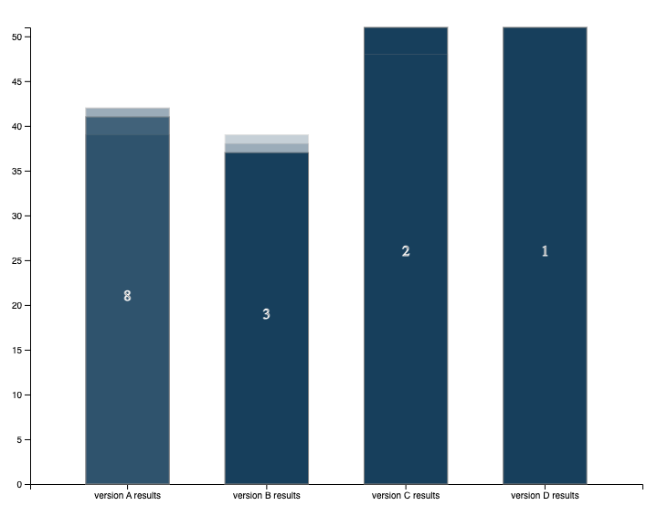
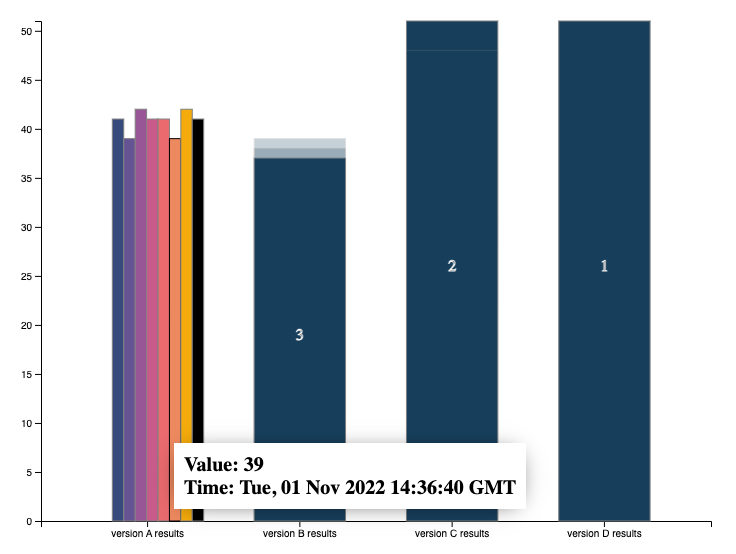

# Custom chart for versions comparison

This is a custom chart type written in d3js for performance comparison between multiple versions.

Resuls dictionary/json should be provided as in the `sample-results.json` model.

To test, a local web server should be installed:
```
npm install http-sever -g
```

Run the server using:

```
http-server
```

Chart results defined in `sample_results.json` should be displayed in a manner similar to the one in the screenshot below:


When click on any columns, it will expand into the number of nested records, number which is also shown on each collapsed column 

Hovering over any expanded column will show the timestamp of the measurement record.

Still WIP.